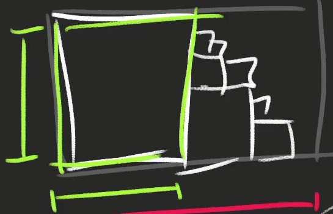

# Notities ThreeJS Journey
## 05 - Transform objects
### Position
- x = right (RED)
- y = up (GREEN)
- z = towards you (BLUE)

```js
// AXES HELPER
const axesHelper = new THREE.AxesHelper(3); // AxesHelper(length)
scene.add(axesHelper);
```

### Put it anywhere
As long as you move it before the ```render(...)```

### DistanceTo (les 05)
Distance between two points > Ultrasone sensor!

### Groups
Move, scale, rotate... a group of objects etc.

## 06 - Animations
### requestAnimationFrame
**PURPOSE:** Call a function on the next frame

## 07 - Cameras
**StereoCamera:** two cameras that mimic the eyes to creata  parallax effect
(VR etc)

**OrthographicCamera:** render without perspective

### Controls
Use controls you need or make your own if not good enough.
e.g. OrbitControls

## 09 - Geometries
TubeGeometry > wires?

## 11 - Textures
- **Color (or albedo):** images that cover the surface
- **Alpha**
- **Height or displacement:** moves vertices
- **Normal:**
  - No subdivision needed
  - Adds details "magically"
- **Ambient occlusion:** fake shadow in surface's crevices
  - Not physically accurate, but helps to create contrast
- **Metalness:** which part is (non-)metallic (helps with reflection)
- **Roughness:** which part is rough and smooth (helps dissipate light)
- ...

### PBR principles
Physically based rendering
Tends to follow real-life directions to get realistic results

### Mipmapping
Texture size divided by two until 1
  

Texture needs to be a power of 2 (512, 1024, 2048)

### Some places to find textures
poliigon.com
3dtextures.me
arroway-textures.ch

## 13 - 3D text
### Get a typeface font
- Convert your font with converters like this one: https://gero3.github.io/facetype.js/. You have to provide a file and click on the convert button.
- Find fonts in the three.JS examples /node_modules/three/examples/fonts/