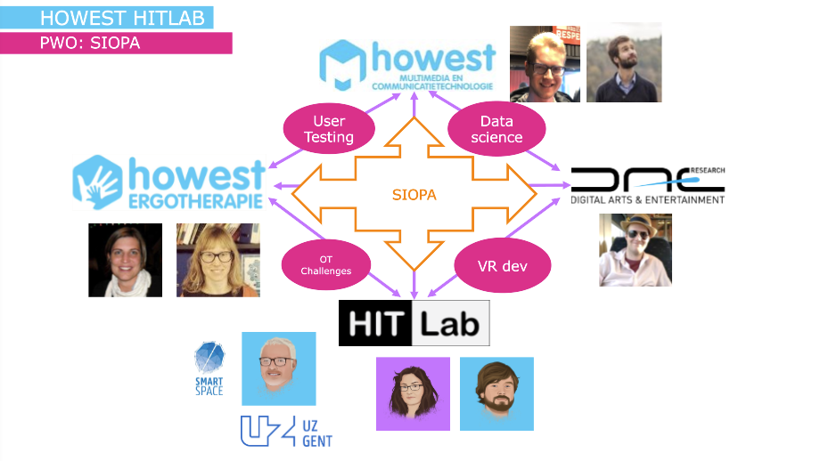

# Prof. Dr. Jelle Damenet
**Human Interface Technology:** Hoe XR en Biometrische data innovatie kunnen ondersteunen

## Inleiding
Machine tracht mens meer te begrijpen
Hitlab gaat hiermee experimenteren in verschillende sectoren.

Hoe kunnen we deze metingen gebruiken om adaptievere interfaces te maken die zich aanpassen aan de gebruiker zijn situatie.

Ofzo?

low-end apparatuur
problemen in sectoren

## Verslag
ponskaart > keyboard, muis > speech > gesture > meten van gedachten

### Menselijke data
- gedrag (camera, kinect)
- eye-tracking
  - fauvial rendering: enkel renderen waar de user naar kijkt etc
- biometrie
- hersenactivatie
  - Waar hebben mensen het meeste moeite mee (bij VR assemblage)

### Way or working
Planning: met experts samenzitten

Meerdere iteraties: testen met gebruikers, opnieuw verderwerken
Zo de bal niet misslaan

### Expertgaze: adaptive instructions based on eye-tracking
Maatwerkbedrijven
Mensen assembleren een bepaalde technologie
Met een kinect kijken ze welke instructies de gebruiker nodig heeft
Arkite maakt een projectiesysteem

Feedback als het het correcte bakje gebruikenn etc

Nu enkel op basis van de locatie van je hand, maar sommige mensen hebben minder instructies nodig.

Hitlab: eye-tracking toegevoegd
Eye-tracker gehackt zodat hij op een horizontaal vlak (een tafel) kan tracken

Gemeten welk soort instructie wordt het meest bekeken en hangt dat af van het expertise niveau?

Instructies laten wegvallen > niet teveel informatie (en dus belasting)

### Assessment militaire vaarexpertise
Marine: kunnen we eye-tracking gebruiken in het leren varen

Proces van een manoeuvre vastleggen
- Bij experten in kaart gebracht waar ze naartoe kijken in iedere fase
- Nu: bij beginners kijken hoe dit afwijkt van de experten

### PWO: SIOPA

Gedigitaliseerde versie van Star Cancellation Task

niet-aangeboren hersenletsel

verstoring in visuele aandacht (bepaald deel van visueel veld "negeren": kijken maar niet zien)

Belangrijk van een goede assesment te hebben

In de taak moeten mensen op en blad de kleine sterren zoeken tussen de grote: aanvinken en tellen. Nu gebeurt dat op papier: dat kunnen ze verleggen naar een stuk dat ze wel goed kunnen zien. In VR kun je in kaart brengen of ze hun hele visuele veld gebruiken.

### SIOPA: veilig straat oversteken
Revalidatietool waarin we detecteren als iemand op een veilige manier de straat oversteekt

Terugkoppelen wat mensen wel en niet gezien hebben

### SIOPA: Virtuel Wheelchair
Nieuwe elektrische rolstoel: Niet genoeg plaats om daar op een veilige manier mee te oefenen

In VR alle manoeuvres op een leuke en veilige manier oefenen

### M&M: Adaptive personalised VR training
Taak waarin mensen geleerd wordt om bepaalde dozen op een bepaalde manier te sorteren in een karretje

zo goed mogelijk sorteren, zo weinig mogelijk plaats tussen 

Veel mensen moeten opgeleid worden: VR voor eerste stappen in training

Steeds complexer laten worden (snellere loopband)

Stress meten: ademhalingsfrequentie, huidgeleiding,

Snelheid van de training laten afhangen van het stressniveau

Test: gaat deze training effectief sneller?

### AR: Augmented work instructions
AR voor assemblagetaken
Tonen waar de stukken liggen

### AR: Hololens2 + object recognition + eye tracking
### AR: Marine surveillance
Bij patrouille opdrachten assisteren

Rondvaren en kijken als bepaalde schepen er mogen zijn/passeren of niet

Informatie van het schip op het schip plotten

Niet enkel afgaan op foto's van de boot, maar ook op kijkhoek: AIS data (locatie vd boten)

### SSB: VR Postsorteertraining supportsquare
Geleerd om eye-tracking data toe te voegen aan hun applicatie.

Het is een zoek taak, dus op deze manier kan je sneller deze taken aanleren.

### SSB: Validatie VR brandtraining onebonsai
Mensen leren om vuur te blussen (brandweertrainingen, maar ook particulieren)

Feedback: Wekt niet genoeg stressen op
Hitlab: Hoe kunnen we hun trainingen realistischer en stresserender maken?

### SSB: Virtuele vaccinatierobot voxdale
Voxdale bouwt een vaccinatierobot
Paar honderdduizend euro erin gestopt

Robot zuigt vaccin op en je moet je hand in een gat steken

In virtuele omgeving: van welke robot zijn mensen het meeste bang?

Weer met stress factoren

### DAE: Echos of red

### Zelf brainstormen

## Besluit + kritische reflectie
Anders naar technologie kijken wanneer je een oplossing moet bedenken op een probleem.

## Referenties (extra opzoekingen)